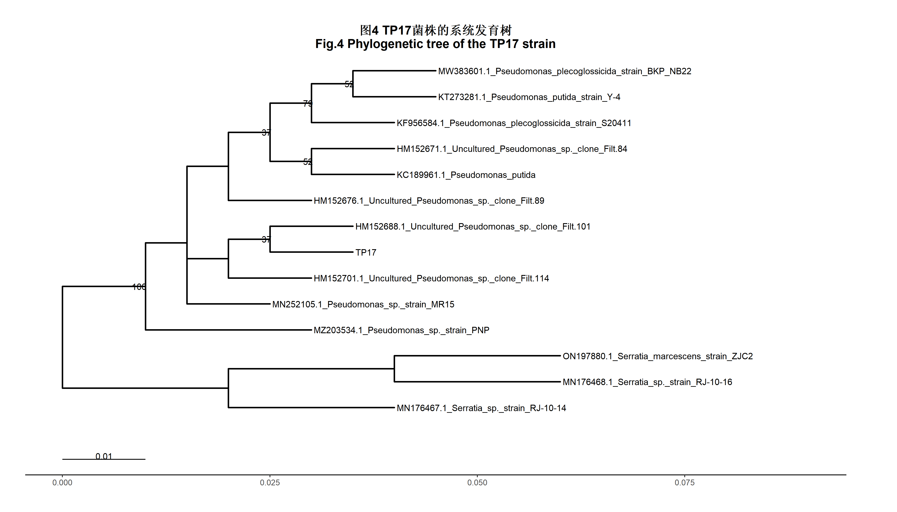

> 📦 **源代码**: [GitHub 仓库](https://github.com/LiBoFei1129/soil-cadmium-immobilized-bacteria)

## 1. 项目概述

本项目复现论文中图4、图5、图12，包含完整代码、原始数据、结果与研究内容解读。

**研究背景**：磁性SA/PVA/Fe3O4复合载体固定化耐受菌株对土壤镉的吸附及其机理研究。

**复现内容**：

| 图表 | 成员 | 内容 |
|------|------|------|
| 图5 | 李愽菲 | TP17菌株在不同镉浓度胁迫下的生长曲线 |
| 图4 | 陈燕姿 | TP17菌株的系统发育树 |
| 图12 | 唐迎秋 | MPS-T在土壤中5次循环使用对镉形态转化的影响 |

---

## 2. 图5：TP17菌株生长曲线

### 2.1 研究目的

探究TP17菌株对重金属镉的耐受特性，为其在镉污染土壤修复中的应用提供微生物学基础数据。

### 2.2 实验设计

- 以0 mg·L⁻¹为空白对照
- 设置50~300 mg·L⁻¹共6个镉浓度梯度
- 以600 nm波长下的吸光度（OD₆₀₀ₙₘ）表征菌株生物量
- 连续监测96 h内菌株的生长动态

### 2.3 复现结果


**结果解读**：

- 镉浓度越高，菌株最大生物量（OD₆₀₀）越低，高浓度对生长有显著抑制作用
- 所有浓度组均呈现典型的延迟期、对数期、稳定期生长特征
- 误差棒代表3次生物学重复的标准误，数据重复性良好
- 结果验证了TP17菌株的镉耐受能力，为后续固定化菌株吸附土壤镉的研究提供基础

### 2.4 R代码

```{r}
#| eval: false
#| warning: false
#| message: false
# 生长曲线绘制代码
library(ggplot2)
library(readxl)

# 读取数据
data <- read_excel("TP17_strain_data（4）.xlsx")

# 绘制生长曲线
ggplot(data, aes(x = Time, y = OD600, color = factor(Cd_Concentration))) +
  geom_line() +
  geom_point() +
  geom_errorbar(aes(ymin = OD600 - SE, ymax = OD600 + SE), width = 0.2) +
  labs(
    title = "TP17 Strain Growth Curve Under Different Cd Concentrations",
    x = "Time (h)",
    y = "OD600",
    color = "Cd (mg/L)"
  ) +
  theme_minimal()
```

---

## 3. 图4：TP17菌株系统发育树

### 3.1 研究目的

明确TP17菌株的分类学地位，为其后续的功能研究（如重金属耐受、环境修复应用）提供分类学依据。

### 3.2 构建方法

基于16S rRNA序列构建系统发育树，展示TP17菌株与其他近缘菌株的系统发育关系。

### 3.3 复现结果



**结果解读**：

- TP17菌株与多株假单胞菌属（*Pseudomonas*）菌株聚为同一大分支
- 与HM152688.1等未培养假单胞菌的亲缘关系最近
- 假单胞菌属分支的根节点自举值达100，证明了该类群的进化可靠性
- 沙雷氏菌属（*Serratia*）菌株形成独立的外类群分支
- 证实TP17菌株归属于假单胞菌属

### 3.4 R代码

```{r}
#| eval: false
#| warning: false
#| message: false
# 系统发育树构建代码
library(ape)
library(readxl)

# 读取序列数据
data <- read_excel("TP17_strain_data.xlsx")

# 构建系统发育树（邻接法）
tree <- nj(seqalignment)

# 绘制系统发育树
plot(tree, type = "unrooted")
```

---

## 4. 图12：MPS-T循环使用对镉形态转化的影响

### 4.1 研究目的

验证MPS-T材料的循环稳定性与镉钝化修复潜力，为镉污染土壤的可持续修复提供数据支撑。

### 4.2 实验设计

- 基于20 mg·kg⁻¹镉污染土壤的5次循环修复试验
- 展示MPS-T在多次循环使用过程中对土壤镉形态的调控效果

### 4.3 复现结果


**结果解读**：

- 随着循环次数增加，高活性、高生物有效性的可交换态镉（S1）占比显著降低并维持在稳定水平
- 碳酸盐结合态镉（S2）占比小幅下降
- 稳定性更强的铁锰氧化物结合态镉（S3）、有机结合态/残渣态镉（S4）占比整体提升
- MPS-T在5次循环后仍能持续将土壤中活性镉转化为低毒、稳定的钝化态

### 4.4 R代码

```{r}
#| eval: false
#| warning: false
#| message: false
# 镉形态转化图绘制代码
library(ggplot2)
library(readxl)

# 读取数据
data <- read_excel("Effect of five cycles of MPS-T in the soil on the transformation of Cd forms.xlsx")

# 绘制堆叠柱状图与折线图组合
ggplot(data, aes(x = Cycle, y = Percentage, fill = Cd_Form)) +
  geom_bar(stat = "identity", position = "stack") +
  geom_line(aes(y = Stabilization_Rate), color = "red", size = 1) +
  labs(
    title = "Effect of MPS-T on Cd Forms Transformation",
    x = "Cycle Number",
    y = "Percentage (%)",
    fill = "Cd Form"
  ) +
  theme_minimal()
```

---

## 5. 项目总结

### 5.1 主要成果

1. **生长曲线**：验证了TP17菌株在0-300 mg/L镉浓度下的耐受能力
2. **系统发育树**：明确了TP17菌株归属于假单胞菌属
3. **循环实验**：证明了MPS-T材料在5次循环后仍能有效钝化土壤镉

### 5.2 项目成员

| 成员 | 学号 | 负责内容 |
|------|------|----------|
| 李愽菲 | 2025303110067 | 生长曲线分析 |
| 唐迎秋 | 2025303120084 | 镉形态转化分析 |
| 陈燕姿 | 2025303110081 | 系统发育树构建 |

### 5.3 数据来源

- **原始论文DOI**: 见仓库README
- **GitHub仓库**: https://github.com/LiBoFei1129/soil-cadmium-immobilized-bacteria
